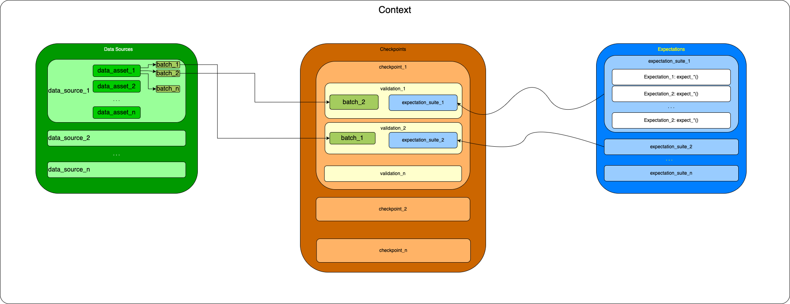
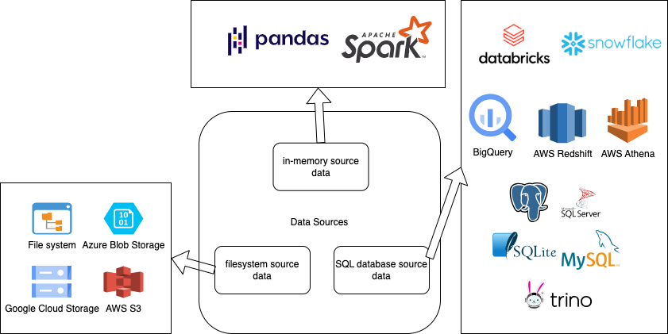

# Great Expectations - Use Case Disney

Validation de la qualité des données avec la librairie [Great Expectations](https://greatexpectations.io/).

---

Great Expectations est une librairie Python pour définir est valider les états acceptables des données.
En définissant des attentes claires pour lesx données, il garantit que les données répondent à ces attentes, ce qui les rend plus fiables et plus faciles à utiliser.


*Source: <https://docs.greatexpectations.io/docs/>*

---

## Terminologie

- **Data Source**: Fournit une API pour accéder et interagir avec les données d'une grande variété de systèmes source.
- **Data Asset**: utilisé pour spécifier comment Great Expectations organisera les données en lots (Batches).
- **Batch**: Une sélection d'un Data Asset. Les tests seront executés sur un/des Batch(es).

---

<!-- ## Terminologie -->

- **Expectation**: Une affirmation ou un test vérifiable sur les données.
- **Expectation Suite**: une liste de d'expectations (tests).
- **Validator**: Utilisé pour exécuter une suite de tests par rapport aux données.
- **Checkpoint**: Le principal moyen de validation des données dans un déploiement en production de Great Expectations.

---

## Les composants de Great Expectations

- **Contexte** : Paramètres et metadonnées sur le projet. Point d'entrée pour l'API Python.
- **Datasource** : Source de données à partir de laquelle les données sont requétées pour les validations.
- **Expectations** : définitions des tests et conformités à valider.
- **Checkpoints** : Validations de batches de données par des listes de tests (Expectation suites).

---

### Contexte


GX Contexte

*Source: <https://docs.greatexpectations.io/docs/guides/setup/setup_overview>*

---

<!-- ### Contexte -->


GX Context components

---

<!-- ## Contexte -->

- Connexion/Création au contexte:

```python
# main.py
import great_expectations as gx

# initialise, instancie, et retourne un contexte de données.
context = gx.get_context()
```

```bash
├── main.py
└── great_expectations
    ├── great_expectations.yml
    ├── checkpoints
    ├── expectations
    ├── plugins
    ├── profilers
    └── uncommitted
```

*Source: <https://docs.greatexpectations.io/docs/guides/setup/configuring_data_contexts/instantiating_data_contexts/instantiate_data_context>*

---

### Datasource


GX data sources

*Source: <https://docs.greatexpectations.io/docs/guides/connecting_to_your_data/connect_to_data_lp>*

---

<!-- ### Datasource -->

#### Source de données: système de fichiers

```bash
├── main.py
└── data
    └── csv
        ├── PROD_CURATED_DLP_TICREGISTRATIONS_VIEW_V2_2023_01.csv
        ├── PROD_CURATED_DLP_TICREGISTRATIONS_VIEW_V2_2023_02.csv
        ├── PROD_CURATED_DLP_TICREGISTRATIONS_VIEW_V2_2023_03.csv
        ├── PROD_CURATED_DLP_TICREGISTRATIONS_VIEW_V2_2022_01.csv
        ├── PROD_CURATED_DLP_TICREGISTRATIONS_VIEW_V2_2022_02.csv
        ├── PROD_CURATED_DLP_TICREGISTRATIONS_VIEW_V2_2022_03.csv
        ├── PROD_CURATED_DLP_TICREGISTRATIONS_VIEW_V2_2021_01.csv
        ├── PROD_CURATED_DLP_TICREGISTRATIONS_VIEW_V2_2021_02.csv
        ├── PROD_CURATED_DLP_TICREGISTRATIONS_VIEW_V2_2021_03.csv
        └── PROD_CURATED_DLP_TICREGISTRATIONS_VIEW_V2_2021_04.csv
```

---

<!-- ### Datasource -->

##### Définition de la source de données

```python
datasource_name = "disney_csv"
path_to_folder_containing_csv_files = "./data/csv/"

datasource = context.sources.add_pandas_filesystem(
    name=datasource_name,
    base_directory=path_to_folder_containing_csv_files
)
```

*Source: <https://docs.greatexpectations.io/docs/guides/connecting_to_your_data/fluent/filesystem/connect_filesystem_source_data>*

---

<!-- ### Datasource -->

##### Définition du data asset à partir de la source de données

```python
asset_name = "disney_asset1"
batching_regex = r"PROD_CURATED_DLP_TICREGISTRATIONS_VIEW_V2_(?P<year>\d{4})_(?P<month>\d{2}).csv"

datasource.add_csv_asset(name=asset_name, batching_regex=batching_regex)
```

*Source: <https://docs.greatexpectations.io/docs/guides/connecting_to_your_data/fluent/filesystem/connect_filesystem_source_data>*

---

<!-- ### Datasource -->

##### Requêter un/des batch(es) de données

```python
# Get the datasource
disney_datasource = context.get_datasource("disney_csv")
# Get the data asset
data_asset = disney_datasource.get_asset("disney_asset1")
```

---

###### Exemple 1

```python
# Get the batch request (Year: 2023)
batch_request = data_asset.build_batch_request({"year": "2023"})
```

Batches obtenus:

```bash
├── PROD_CURATED_DLP_TICREGISTRATIONS_VIEW_V2_2023_01.csv
├── PROD_CURATED_DLP_TICREGISTRATIONS_VIEW_V2_2023_02.csv
├── PROD_CURATED_DLP_TICREGISTRATIONS_VIEW_V2_2023_03.csv
```

---

<!-- ### Datasource -->

###### Exemple 2

```python
# Get the batch request (Month: 03)
batch_request = data_asset.build_batch_request({"month": "03"})
```

Batches obtenus:
<!--
```python
batches = my_asset.get_batch_list_from_batch_request(batch_request)
for batch in batches:
    print(batch.batch_spec)
```
 -->

```bash
├── PROD_CURATED_DLP_TICREGISTRATIONS_VIEW_V2_2023_03.csv
├── PROD_CURATED_DLP_TICREGISTRATIONS_VIEW_V2_2022_03.csv
├── PROD_CURATED_DLP_TICREGISTRATIONS_VIEW_V2_2021_03.csv
```

---

<!-- ### Datasource -->

#### Source de données: Base de données SQL

##### Définition de la source de données (SQL)

```python
datasource_name = "disney_sql"
my_connection_string = (
    "postgresql+psycopg2://<username>:<password>@<host>:<port>/<database>"
)

datasource = context.sources.add_postgres(
    name=datasource_name,
    connection_string=my_connection_string
)
```

Voir les strings de connexion des autres sources de données: <https://docs.greatexpectations.io/docs/guides/connecting_to_your_data/fluent/database/connect_sql_source_data>

---

<!-- ### Datasource -->

<!-- #### Source de données: Base de données SQL -->

##### Définition du data asset à partir de la source de données (SQL)

###### Table

```python
asset_name = "disney_asset2"
asset_table_name = "TICKET_REGISTRATION_VIEW_V2"

table_asset = datasource.add_table_asset(
    name=asset_name,
    table_name=asset_table_name
)
```

---

<!-- ### Datasource -->

<!-- #### Source de données: Base de données SQL -->

<!-- ##### Définition du data asset à partir de la source de données -->
###### Requête SQL

```python
asset_name = "disney_asset3"
asset_query = """
    SELECT *
    FROM TICKET_REGISTRATION_VIEW_V2
    WHERE inventory_bucket = 'DLP_BOTH_TICKET_QUOTIDIEN'
"""

query_asset = datasource.add_query_asset(
    name=asset_name,
    query=asset_query
)
```

---

<!-- ### Datasource -->

<!-- #### Source de données: Base de données SQL -->

##### Requêter un/des batch(es) de données (SQL)

```python
table_batch_request = table_asset.build_batch_request()
query_batch_request = query_asset.build_batch_request()
```

---

### Expectations

Sources d'expectations:

- A partir de la galerie des expectations: voir <https://greatexpectations.io/expectations/>
- Custom expectations (Tests personnalisés): <https://docs.greatexpectations.io/docs/guides/expectations/custom_expectations_lp>

Deux façons pour définir les expectations (tests) à inclure dans la validation:

- Création sans inspection direct des données.
- Création interactive avec Python.

---

#### Expectations: Création d'Expectations sans inspection direct des données

Création d'une ExpectationSuite

```python
suite = context.add_expectation_suite(expectation_suite_name="disney_expectation_suite")
```

---

<!-- #### Expectations: Création d'Expectations sans inspection direct des données -->

Création d'une configuration d'Expectation

```python
expectation_configuration_1 = ExpectationConfiguration(
    expectation_type="expect_column_values_to_be_in_set",
    kwargs={
        "column": "REGISTRATION_STATUS_LABEL",
        "value_set": ["NEW", "CANCELED", "REDEEMED"],
    },
    meta={
        "notes": {
            "format": "markdown",
            "content": "Expect the values of 'REGISTRATION_STATUS_LABEL' column to either 'NEW', 'CANCELED' or 'REDEEMED'. **Markdown** `Supported`",
        }
    },
)
suite.add_expectation(expectation_configuration=expectation_configuration_1)
```

---

<!-- #### Expectations: Création d'Expectations sans inspection direct des données -->

Sauvegarder les Expectations pour un usage ultérieur

```python
context.save_expectation_suite(expectation_suite=suite)
```

*Source: <https://docs.greatexpectations.io/>*

---

#### Expectations: Création d'Expectations de façon interactive avec Python

```python
# Get the datasource
disney_datasource = context.get_datasource("disney_csv")
# Get the data asset
data_asset = disney_datasource.get_asset("disney_asset1")
# Get the batch request
batch_request = data_asset.build_batch_request({"year": "2023"})
```

---

<!-- #### Expectations: Création d'Expectations de façon interactive avec Python -->

Créer une suite d'expectations:

```python
context.add_or_update_expectation_suite("disney_suite")
```

Créer un validator:

```python
validator = context.get_validator(
    batch_request=batch_request,
    expectation_suite_name="disney_suite",
)
```

---

<!-- #### Expectations: Création d'Expectations de façon interactive avec Python -->

Ajouter les expectations à valider:

```python
validator.expect_table_row_count_to_be_between(min_value=1)
```

```python
validator.expect_column_values_to_not_be_null("VISUAL_ID")
validator.expect_column_values_to_not_be_null("ACTIVITY_DATE")
validator.expect_column_values_to_not_be_null("ACTIVITY_DATETIME")
```

```python
validator.expect_column_values_to_be_in_set(
    column="REGISTRATION_STATUS_LABEL",
    value_set=['NEW', 'CANCELED', 'REDEEMED']
)
```

---

<!-- #### Expectations: Création d'Expectations de façon interactive avec Python -->

Ajouter les expectations à valider:

```python
validator.expect_column_sum_to_be_between(
    column='QUANTITY_REGISTRATION',
    min_value=100,
    max_value=4000,
    condition_parser='pandas',
    row_condition=f'INVENTORY_BUCKET=="DLP_BOTH_TICKET_QUOTIDIEN" & ACTIVITY_DATE=="{date}"'
)
```

---

<!-- #### Expectations: Création d'Expectations de façon interactive avec Python -->

Sauvegarder les Expectations pour un usage ultérieur:

```python
validator.save_expectation_suite(
    discard_failed_expectations=False
)
```

---

#### Custom Expectations

Une Custom Expectation est une extension de la classe Expectation, développée et adaptée à des besoins spécifiques pour étendre les fonctionnalités de Great Expectations.

---

### Checkpoints

Les points de verifications "checkpoints" permettent de:

- Valider les données.
- Sauvegarder les résultats de la validation.
- Créer les "Data Docs" avec leurs résultats.
- Executer d'autres actions spécifiées.

---

#### Créer un Checkpoint

```python
disney_check_checkpoint = context.add_or_update_checkpoint(
    name="disney_check",
    validations=[
        {
            "batch_request": query_batch_request,
            "expectation_suite_name": "disney_expectation_suite",
        },
        {
            "batch_request": table_batch_request,
            "expectation_suite_name": "disney_expectation_suite",
        },
    ],
)
```

---

#### Lancer un Checkpoint

```python
checkpoint_result = disney_check_checkpoint.run()
```

---

#### Récupérer un Checkpoint

```python
disney_check_checkpoint = context.get_checkpoint(name="disney_check")
```

---

#### Actions d'un Checkpoint

```yaml
action_list:
  - name: store_validation_result
    action:
      class_name: StoreValidationResultAction
  - name: store_evaluation_params
    action:
      class_name: StoreEvaluationParametersAction
  - name: update_data_docs
    action:
      class_name: UpdateDataDocsAction
```

---

##### Ajouter les notificatins Slack après validation des données

1. Ajouter le `webhook` de l'application Slack dans le fichier des variables de configuration situé dans `config_variables_file_path`:

    ```yaml
    validation_notification_slack_webhook: https://hooks.slack.com/services/XXXXXXXXXXX/XXXXXXXXXXX/XXXXXXXXXXXXXXXXXXXXXXXX
    ```

---

2. Ajouter l'action d'envoyer les notifications

```yaml
action_list:
  #--------------------------------
  - name: send_slack_notification_on_validation_result # name can be set to any value
    action:
      class_name: SlackNotificationAction
      # put the actual webhook URL in the uncommitted/config_variables.yml file
      slack_webhook: ${validation_notification_slack_webhook}
      notify_on: all # possible values: "all", "failure", "success"
      notify_with: # optional list containing the DataDocs sites to include in the notification.
      # Defaults to including links to all configured sites.
      renderer:
        module_name: great_expectations.render.renderer.slack_renderer
        class_name: SlackRenderer
  #--------------------------------
```

---

### Data Assistants & Profilers

#### Data Assistant

Utilitaire qui interroge les données, décrire ce qui est observé, puis propose des tests basées sur les résultats des observations.

#### Profiler

Génère des métriques et des tests candidats à partir des données.

---

### Plugins

Étend les composants et/ou les fonctionnalités de Great Expectations.

Les fichiers Python placés dans le répertoire `plugins/` du projet peuvent être utilisés pour étendre les fonctionnalités de Great Expectations. Les modules ajoutés  peuvent être référencés dans des fichiers de configuration ou importés directement dans des scripts ou des notebooks Jupyter.

---
